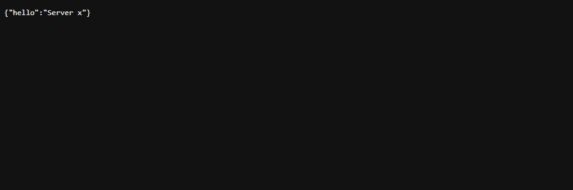
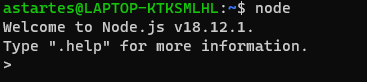
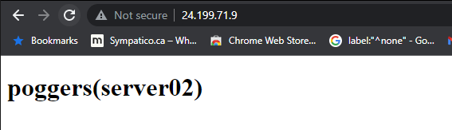
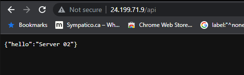

# 2420 Assignment 2

## Authors:
Hai Run(Kooby) Yin (A01186094)

## Incorporated Systems Include:
Windows WSL 
Digital Ocean Droplets 
Digital Ocean Firewall 
Digital Ocean Load Balancer

## Important Note
This guide operates under the assumption you already have WSL and your droplets set up.

### Step 1: Setting up Infrastructure

1.1  
    Under the networking tab select the create dropdown menu and select Load Balancer 
    Follow the instructions on digital ocean and add your droplets via **tags** or the names of your droplets 
     

1.2 
    To create the Firewall, utilize the same dropdown menu as above and choose Firewall 
    Add an inbound rule for HTTP and change the Sources to your load balancer from the previous step 
    
    
    Add your droplets to your firewall and press the **Create Firewall** button.
     

1.3  
    Congratulations you have setup the necessary infrastructure for this project.

### Step 2: Installing Web server to droplets

2.1 
    Open windows terminal and SSH into your droplets.

2.2 
    Run the following command 
    **wget https://github.com/caddyserver/caddy/releases/download/v2.6.2/caddy_2.6.2_linux_amd65.tar.gz** 

2.3 
    Unzip the downloaded caddy file by running 
    tar xvf caddy_2.6.2_linux_amd64.tar.gz 

2.4 
     using chown change the owner and group of the caddy file to **root** 
    then copy the caddy file to the bin directory 
    **sudo cp caddy /usr/bin**

### Step 3: Writing Web Application

3.1 
    In a third windows terminal connect to your WSL instance.
    Using **mkdir** create a new directory named AS2(Or anything you would like)
    **CD** into the new directory and create 2 more named **HMTL** and **SRC** respectively.

3.2 
    CD into the SRC folder and run the following 2 commands  
    **npm init**
    **npm i fastify** 
    the first command will prompt you to enter some additional information. You can skip all of it if you choose to. 
    
3.3 
    Use **vim touch index.js** to create a javascript file within your src directory 
    copy the following code into the index.js file 
    
    // Require the framework and instantiate it 
    const fastify = require('fastify')({ logger: true })

    // Declare a route 
    fastify.get('/', async (request, reply) => {
        return { hello: 'Server x' }
    })

    // Run the server!
    const start = async () => {
        try {
            await fastify.listen({ port: 5050 })
            } catch (err) {
        fastify.log.error(err)
         process.exit(1)
            }
        }
    start()
    
3.4 
    Test your index.js file locally by running the command **node index.js**  
    Go into a webbrowser of choice and enter the url **localhost:5050**  
    You should get a blank page with the words "hello: 'server x'"  
    if all is succesful you can use rsync (or any other file transfer option) to move the html and src directory into your two droplets 
    

### Step 4: Creading Caddyfile(serverblock)

4.1 
    With Caddy we will have to write out a server block in order for Caddy to properly serve the write HTML file when someone accesses the load balancer ip. 
    we will also be adding a **reverse proxy** server as well so when they access (loadbalancer-ip)/api they will be served the "Hello world" message from the node server instead of the HTML 

4.2 
    To begin utilize **cd** to enter your "/etc/" directory. 
    Once in you "/etc/" directory use **mkdir** to create a "/caddy" directory 
    Enter your /etc/caddy directory and create a Caddyfile with **vim Caddyfile** and paste the following content 

    http://24.199.71.9 {
	root * /var/www
	reverse_proxy /api localhost:5050
	file_server
    }
replace the IP address with the one associated with your load balancer 

### Step 5: Installing Node and NPM

5.1 
    Run the following commands to install Node 
    
    curl https://get.volta.sh | bash

    volta install node

    source /home/user/.bashrc

5.2 
    check if node is installed correctly by using the **node** command 
    you should recieve the following message if it is installed correctly 
     

### Step 6: Writing the Service File for Caddy and Node application

6.1 
    You will need both a caddy.service file and a hello_web.service file in order to ensure your server will run constantly in the background

6.2 
    CD into your "/etc/systemd/system" directory and create the following files. 
    "hello_web.service" 
    "caddy.service" 

6.3 
    Caddy.service should look like the following 
    
    [Unit]
    Description=Server html in var/www using caddy
    After=network.target

    [Service]
    Type=notify
    ExecStart=/usr/bin/caddy run --config /etc/caddy/Caddyfile
    ExecReload=/usr/bin/caddy reload --config /etc/caddy/Caddyfile
    TimeoutStopSec=5
    KillMode=mixed

    [install]
    WantedBy=multi-user.target

6.4 
    hello_web.service should look like the following 

    [Unit]
    Description=Start node application in as2/src using nodejs
    Wants=network-online.target
    Requires=network-online.target

    [Service]
    User=astartes
    Group=astartes
    ExecStart=/home/astartes/.volta/bin/node /home/astartes/as2/src/index.js
    Restart=on-failure

    [Install]
    WantedBy=multi-user.target

6.5 
    some slight changes will need to be made to the "hello_web.service" file. 
    Replace all instances of "astartes" with the username of your current user. 

### Step 7: Uploading necessary files to server

7.1 
    Making use of **Rsync** or your preferred file transfer method copy all the files you created to your droplets. This includes your 
    "index.html" 
    "index.js" 
    "package.json" 
    "hello_web.service" 
    "Caddyfile" 
    "caddy.service" 
    
7.2 
    move all the files to the appropriate directories and re-create the necessary directories such as "/etc/caddy" and/or "/var/www". 

7.3 
    Once all the files are in the appropriate locations in accordance to your service file directories, you can change the "index.html" and "index.js" files slightly in order to tell the difference between each server.

7.4 
    run **sudo systemctl daemon-reload** to reload all services 
    run **sudo systemmctl start caddy.service** to start the caddy service 
    run **sudo systemctl start hello_web.service** to start your node server 

### Step 8: Testing Servers

8.1 
    If all your service files start correctly without error. 
    You can go to your favourite web browser and type in your load balancer ip 
    When you go to your load balancer ip you should see something similar to the following 
     
    if you go to your load balancer ip and append "/api" you should see something similar to the following 
     
8.2 
    you can continously refresh the browser and you should see 2 different responses in accordance to the two different servers which are running slightly different "index.html" and "index.js" files.

8.3 
    Congratulations You have completed this tutorial and created your own reverse proxy server!

    

    

