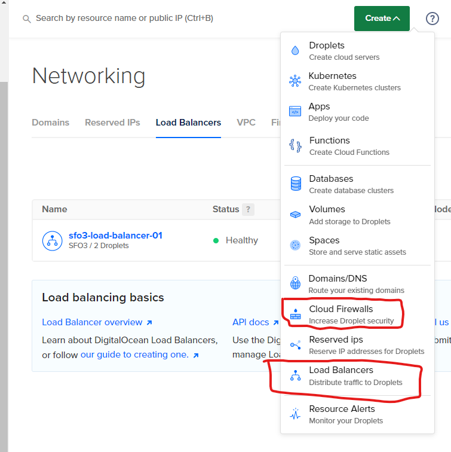
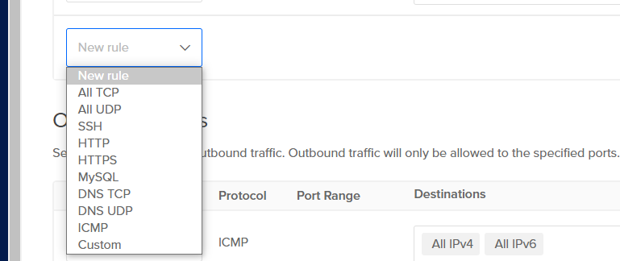
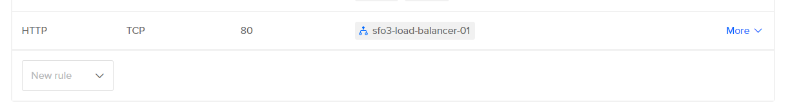
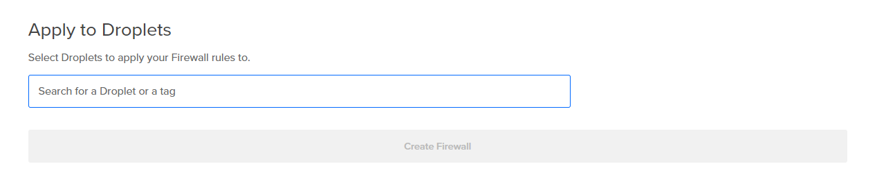

# 2420 Assignment 2

## Authors:
Hai Run(Kooby) Yin (A01186094)

## Incorporated Systems Include:
Windows WSL<br>
Digital Ocean Droplets<br>
Digital Ocean Firewall<br>
Digital Ocean Load Balancer

## Important Note
This guide operates under the assumption you already have WSL and your droplets set up.

### Step 1: Setting up Infrastructure

1.1 
    Under the networking tab select the create dropdown menu and select Load Balancer<br>
    Follow the instructions on digital ocean and add your droplets via **tags** or the names of your droplets<br>
    <br>
1.2 
    To create the Firewall, utilize the same dropdown menu as above and choose Firewall<br>
    Add an inbound rule for HTTP and change the Sources to your load balancer from the previous step<br>
    
    
    Add your droplets to your firewall and press the **Create Firewall** button.
    <br>
1.3 
    Congratulations you have setup the necessary infrastructure for this project.

### Step 2: Installing Web server to droplets

2.1
    Open windows terminal and SSH into your droplets.
2.2 Run the following command<br>
    **wget https://github.com/caddyserver/caddy/releases/download/v2.6.2/caddy_2.6.2_linux_amd65.tar.gz**<br>
2.3 Unzip the downloaded caddy file by running<br>
    tar xvf caddy_2.6.2_linux_amd64.tar.gz<br>
2.4 using chown change the owner and group of the caddy file to **root**<br>
    then copy the caddy file to the bin directory<br>
    **sudo cp caddy /usr/bin**

### Step 3: Writing Web Application

3.1
    In a third windows terminal connect to your WSL instance.
    Using **mkdir** create a new directory named AS2(Or anything you would like)
    **CD** into the new directory and create 2 more named **HMTL** and **SRC** respectively.
3.2
    CD into the SRC folder and run the following 2 commands <br>
    **npm init**
    **npm i fastify**<br>
    the first command will prompt you to enter some additional information. You can skip all of it if you choose to.<br>
3.3
    Use **vim touch index.js** to create a javascript file within your src directory<br>
    copy the following code into the index.js file<br>
    ```
    // Require the framework and instantiate it 
    const fastify = require('fastify')({ logger: true })

    // Declare a route 
    fastify.get('/', async (request, reply) => {
        return { hello: 'Server x' }
    })

    // Run the server!
    const start = async () => {
        try {
            await fastify.listen({ port: 5050 })
            } catch (err) {
        fastify.log.error(err)
         process.exit(1)
            }
        }
    start()
    ```
3.4
    Test your index.js file locally by running the command **node index.js** <br>
    Go into a webbrowser of choice and enter the url **localhost:5050** <br>
    You should get a blank page with the words "hello: 'server x'" <br>
    if all is succesful you can use rsync (or any other file transfer option) to move the html and src directory into your two droplets<br>
    


